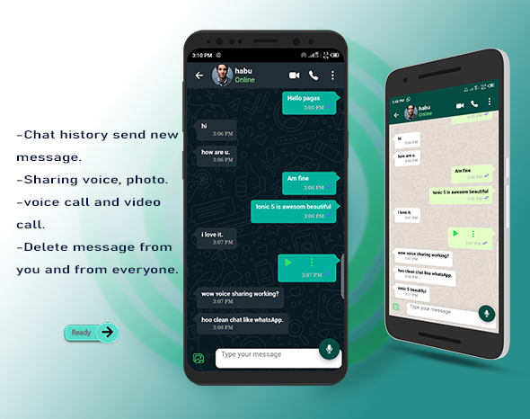

# ionic-5-WhatsApp

        
    

# Overview
    

    
This is a complete Application, that covers everything that you need in WhatsApp chat, this application build on ionic 5 and firebase leatest, the same functionality of whatsApp, messenger version. This is a clean code, more readable and beautiful, each lines of code commented on explain how it work, the code even a bigenners will understand.This Application tested and trusted on Android, IOS one codebase deployed to Android, IOS, web, PWA and also this code is written on ionic 5 framework and back-end is firebase leatest version, the apps style with SASS, which is known as CSS with power of each component has dedicated SASS file for styling make it very beautiful looking UI/UX.

   

        

            
        

        

            <ul>
                <li>User can login/Register with Phone number</li>
                <li>When no connection will notify to user.</li>
                <li>Verification code send via SMS.</li>
                <li>Send verification code</li>
                <li>User received 6 digit code. </li>
            </ul>
        

    

    

        

            
        

        

            <ul>
                <li>User can provide name or username.</li>
                <li>Upload your profile picture.</li>
                <li>Personal information.</li>
            </ul>
        

    

    

        

            
        

        

            <ul>
                <li>Chat conversation.</li>
                <li>Create new broadcast.</li>
                <li>Create new group.</li>
                <li>Read and Unread message.</li>
                <li>Timelapse messgae send.</li>
            </ul>
        

    

    

        

            
        

        

            <ul>
                <li>Post status image.</li>
                <li>Upload Photo from library or camera.</li>
                <li>Viewed Recent updates status.</li>
                <li>Viewed updates status.</li>
                <li>Status privacy.</li>
            </ul>
        

    

    

        

            
        

        

            <ul>
                <li>Make call video base on time.</li>
                <li>Make voice call with user.</li>
                <li>Clear a call log.</li>
            </ul>
        

    

    

        

            
        

        

            <ul>
                <li>Chat message end to end encryption.</li>
                <li>Send voice mail.</li>
                <li>Send Photo message or camera.</li>
                <li>Block user/Unblock user</li>
                <li>User contact info.</li>
                <li>Video call/voice call.</li>
                <li>Delete message from you/from everyone.</li>
            </ul>
        

    

    

        

            
        

        

            <ul>
                <li>Create new group chat.</li>
                <li>Send voice mail.</li>
                <li>Add new members.</li>
                <li>Send report to group.</li>
                <li>Exit from group.</li>
                <li>Send message to group.</li>
                <li>Send Photo message or camera.</li>
                <li>User contact info.</li>
                <li>Make group admin/remove admin.</li>
                <li>Change group name/description/photo.</li>
                <li>Group info page.</li>
                <li>Delete message from you.</li>
            </ul>
        

    

    

        

            
        

        

            <ul>
                <li>Viewed status image.</li>
                <li>High quality image.</li>
                <li>Time posted status.</li>
            </ul>
        

    

    

        

            
        

        

            <ul>
                <li>Video call.</li>
                <li>Vie whos caller user.</li>
                <li>Update time calling user.</li>
            </ul>
        

    

    

        

            
        

    

